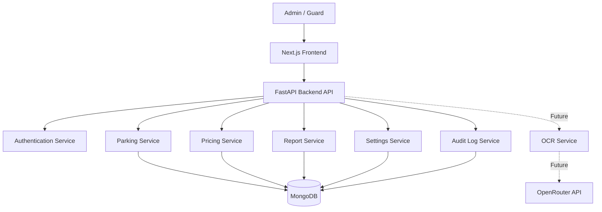
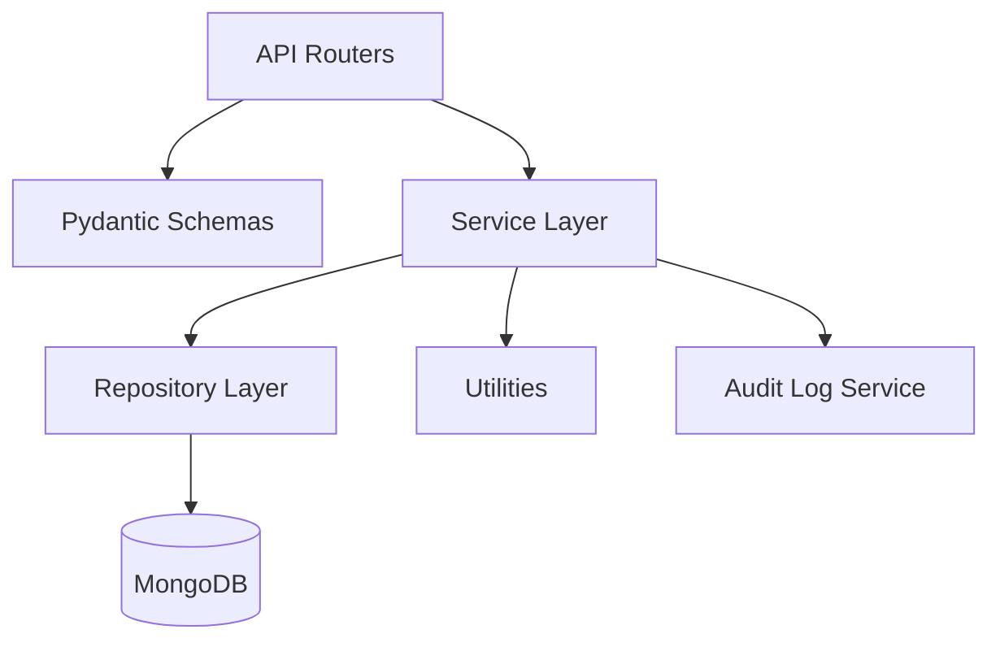
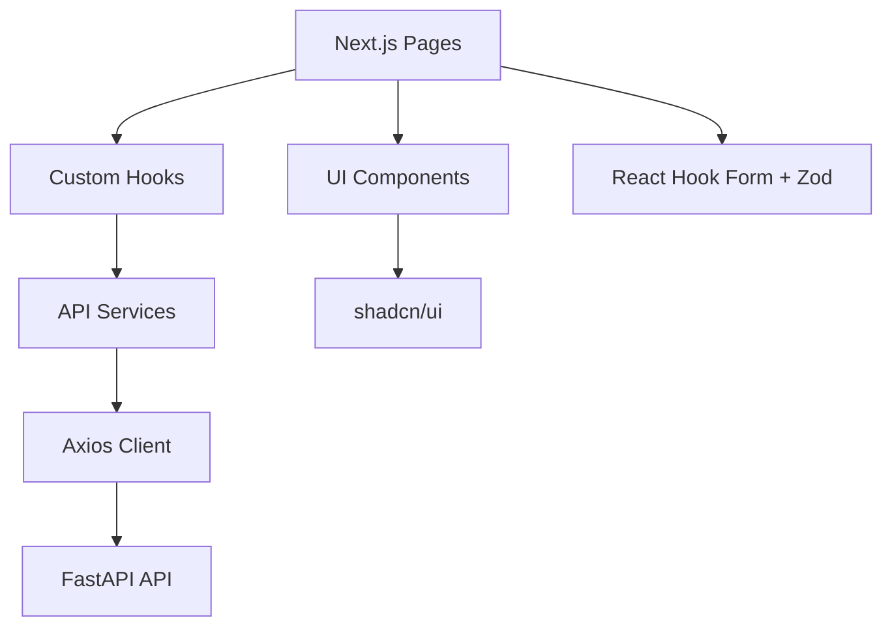
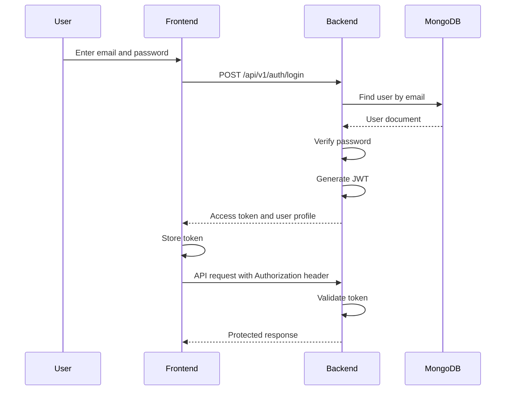
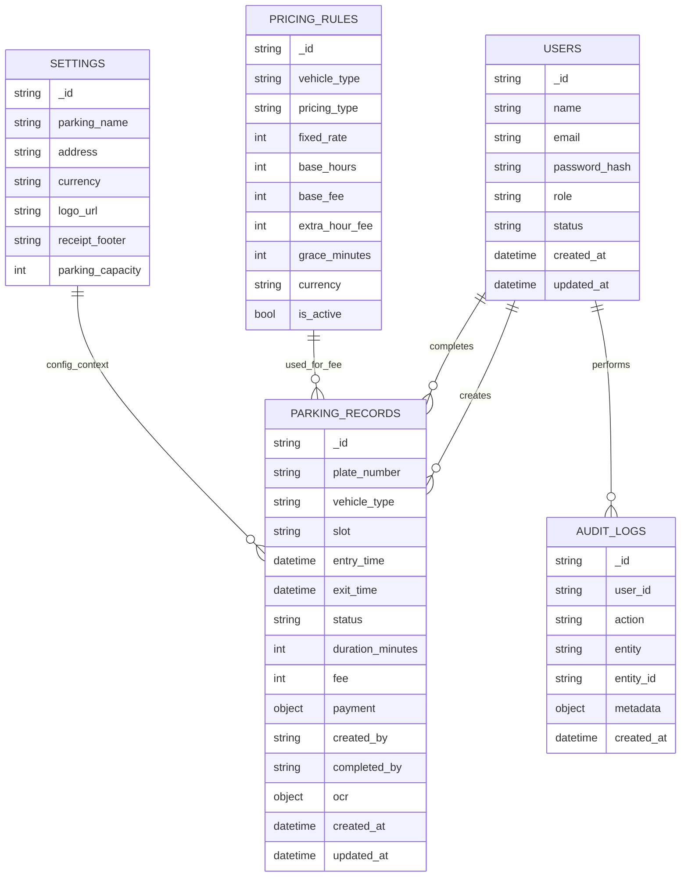
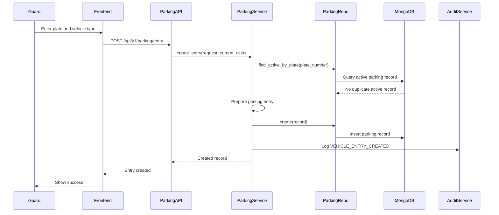
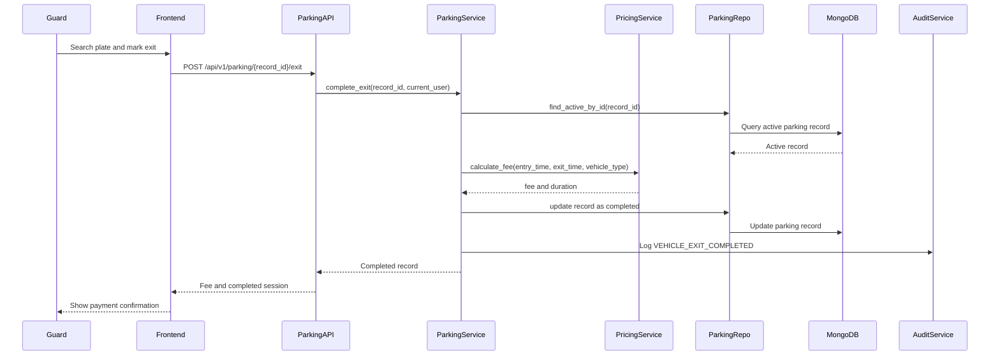
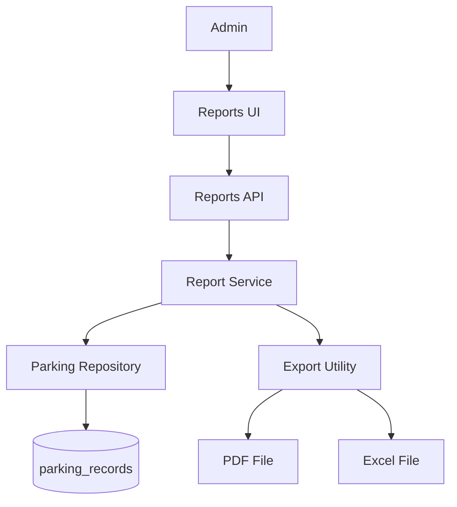
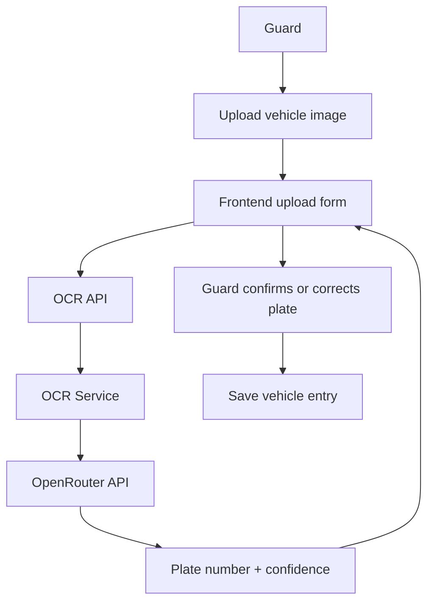

# ParkFlow Architecture

## 1. Project Overview

ParkFlow is a modern Parking Management System for small and medium parking operations such as shopping malls, hospitals, residential societies, schools, office buildings, and private parking lots.

The system is designed as a production-ready MVP with a clean architecture. The first version focuses on the core parking workflow:

* Guard login
* Vehicle entry
* Vehicle exit
* Vehicle search
* Automatic fee calculation
* Cash payment recording
* Admin dashboard
* Pricing management
* Reports
* PDF and Excel exports

OCR, camera integration, online payments, boom barriers, RFID, and multi-branch SaaS billing are planned for future versions.

## 2. Architecture Type

ParkFlow Version 1 will be built as:

```text
Single-business MVP with SaaS-ready architecture
```

This means the first version will manage one parking business at a time, but the code structure will be clean enough to support true SaaS later.

In Version 1, we will not add tenant, mall, operator, subscription, or branch collections. These can be added later without rewriting the full system if the backend is properly layered.

## 3. Main Goals

The main goals of the architecture are:

* Keep the application simple for MVP.
* Keep the backend scalable and maintainable.
* Separate API, service, and database logic.
* Use async FastAPI and MongoDB correctly.
* Keep business logic inside services.
* Keep database operations inside repositories.
* Make the frontend easy to connect with backend APIs.
* Keep OCR optional and separate from the core parking flow.
* Prepare the project for future SaaS expansion.

## 4. MVP Scope

### Included in Version 1

* Authentication
* JWT login
* Admin and Guard roles
* Vehicle entry
* Vehicle exit
* Vehicle search
* Parking history
* Automatic fee calculation
* Cash payment tracking
* Pricing rules
* Dashboard
* Daily reports
* Weekly reports
* Monthly reports
* Custom date range reports
* PDF export
* Excel export
* Settings
* Audit logs

### Not Included in Version 1

* Online payments
* JazzCash
* EasyPaisa
* Stripe
* Camera integration
* Printer integration
* Boom barrier integration
* RFID
* Dedicated parking slots collection
* Multiple branches
* Multi-tenant billing
* Mobile app
* Advanced AI automation

## 5. Technology Stack

## Frontend

```text
Next.js App Router
TypeScript
Tailwind CSS
shadcn/ui
React Query
Axios
React Hook Form
Zod
```

## Backend

```text
Python 3.13+
FastAPI
Motor MongoDB Async Driver
Pydantic v2
JWT Authentication
Passlib
Async architecture
Repository + Service Pattern
```

## Database

```text
MongoDB
Database name: parkflow
```

Development database:

```text
Local MongoDB
```

Production database later:

```text
MongoDB Atlas or self-hosted MongoDB
```

## 6. High-Level System Architecture



## 7. Backend Layered Architecture

The backend will follow a layered structure.



## 8. Backend Layer Responsibilities

### API Layer

The API layer handles HTTP requests and responses only.

Responsibilities:

* Receive request
* Validate request body using Pydantic schemas
* Call service layer
* Return response
* Handle route-level permissions

API routers should not contain business logic.

Example:

```text
POST /api/v1/parking/entry
```

The route should only receive the request and call the parking service.

### Service Layer

The service layer contains business logic.

Responsibilities:

* Vehicle entry rules
* Vehicle exit rules
* Fee calculation
* Payment completion rules
* Report calculation
* Role-based business rules
* Audit log creation
* Validation that requires business context

Example:

```text
ParkingService.create_entry()
ParkingService.complete_exit()
PricingService.calculate_fee()
ReportService.get_daily_report()
```

### Repository Layer

The repository layer handles database operations.

Responsibilities:

* Create documents
* Find documents
* Update documents
* Delete or soft-delete documents
* Build MongoDB queries
* Create indexes where needed

Repositories should not contain business rules.

Example:

```text
ParkingRepository.create()
ParkingRepository.find_active_by_plate()
ParkingRepository.update_exit()
```

### Database Layer

The database layer manages MongoDB connection.

Responsibilities:

* Create MongoDB client
* Expose database instance
* Expose collection references
* Manage connection lifecycle
* Avoid duplicate MongoDB connections

MongoDB connections should never be created directly inside services.

## 9. Backend Module Architecture

```text
backend/

app/
├── api/
│   └── v1/
│       ├── auth.py
│       ├── users.py
│       ├── parking.py
│       ├── pricing.py
│       ├── dashboard.py
│       ├── reports.py
│       ├── settings.py
│       └── ocr.py
│
├── core/
│   ├── config.py
│   ├── security.py
│   ├── permissions.py
│   └── constants.py
│
├── database/
│   └── mongodb.py
│
├── models/
│   ├── user.py
│   ├── parking_record.py
│   ├── pricing_rule.py
│   ├── settings.py
│   └── audit_log.py
│
├── schemas/
│   ├── auth.py
│   ├── user.py
│   ├── parking.py
│   ├── pricing.py
│   ├── dashboard.py
│   ├── report.py
│   └── settings.py
│
├── repositories/
│   ├── user_repository.py
│   ├── parking_repository.py
│   ├── pricing_repository.py
│   ├── settings_repository.py
│   └── audit_log_repository.py
│
├── services/
│   ├── auth_service.py
│   ├── user_service.py
│   ├── parking_service.py
│   ├── pricing_service.py
│   ├── dashboard_service.py
│   ├── report_service.py
│   ├── settings_service.py
│   ├── audit_log_service.py
│   └── ocr_service.py
│
├── middleware/
│   └── error_handler.py
│
├── utils/
│   ├── datetime.py
│   ├── object_id.py
│   └── exports.py
│
└── main.py
```

## 10. Frontend Architecture

The frontend will use Next.js App Router.



## 11. Frontend Folder Structure

```text
frontend/

app/
├── login/
├── dashboard/
├── parking/
│   ├── entry/
│   ├── exit/
│   ├── active/
│   └── history/
├── users/
├── pricing/
├── reports/
├── settings/
└── layout.tsx

components/
├── common/
├── forms/
├── tables/
├── dashboard/
└── parking/

hooks/
├── useAuth.ts
├── useParking.ts
├── usePricing.ts
└── useReports.ts

lib/
├── api.ts
├── auth.ts
└── utils.ts

services/
├── auth.service.ts
├── parking.service.ts
├── users.service.ts
├── pricing.service.ts
├── reports.service.ts
└── settings.service.ts

types/
├── auth.ts
├── user.ts
├── parking.ts
├── pricing.ts
└── reports.ts
```

## 12. User Roles

ParkFlow MVP has two roles.

```text
admin
guard
```

## 13. Guard Responsibilities

The Guard is responsible for daily parking operations.

Guard can:

* Log in
* Add vehicle entry
* Enter plate number manually
* Upload vehicle image for OCR later
* Select vehicle type
* Add optional slot text
* Search active vehicles
* Search completed vehicles
* View parking details
* Mark vehicle exit
* Receive cash
* Complete parking session
* View simple dashboard

Guard dashboard includes:

* Active vehicles
* Today's entries
* Today's exits

## 14. Admin Responsibilities

The Admin has full access to the system.

Admin can:

* Create guard accounts
* Update guard accounts
* Delete guard accounts
* Reset guard passwords
* View all parking records
* Edit parking records
* Delete parking records
* Configure pricing
* Manage settings
* View dashboard
* View revenue
* Generate reports
* Export PDF
* Export Excel

Admin dashboard includes:

* Total revenue
* Today's revenue
* Monthly revenue
* Active vehicles
* Completed vehicles
* Revenue graph
* Parking occupancy
* Recent transactions
* Revenue by guard
* Revenue by vehicle type

## 15. Authentication Architecture

Authentication uses JWT.



JWT payload should include:

```json
{
  "sub": "user_id",
  "role": "admin",
  "exp": 1760000000
}
```

## 16. Authorization Rules

### Admin

Admin can access all modules.

Admin-only modules:

* User management
* Pricing management
* Settings
* Reports
* Full dashboard
* Edit parking records
* Delete parking records

### Guard

Guard can access only operational parking modules.

Guard modules:

* Vehicle entry
* Vehicle exit
* Active vehicle search
* Completed vehicle search
* Guard dashboard

Guard cannot:

* Create users
* Delete users
* Edit pricing
* View full revenue analytics
* Delete parking records
* Manage settings

## 17. Database Architecture

MVP collections:

```text
users
parking_records
pricing_rules
settings
audit_logs
```

There will be no separate collections for:

```text
payments
parking_slots
malls
operators
```

Payment information will be stored inside parking records.

Optional parking slot text will be stored directly on the parking record.

## 18. Database Relationship Overview



## 19. Vehicle Entry Flow



## 20. Vehicle Exit Flow



## 21. Fee Calculation Architecture

Fee calculation belongs in the Pricing Service.

The Parking Service should not directly calculate pricing rules. It should ask Pricing Service for the final fee.

Example responsibility:

```text
ParkingService:
- controls exit flow
- validates active record
- updates parking status
- stores payment information

PricingService:
- loads pricing rule
- calculates duration
- applies fixed or hourly pricing
- returns fee
```

This separation makes pricing easier to update later.

## 22. Pricing Modes

ParkFlow MVP should support two pricing modes:

```text
fixed
hourly
```

### Fixed Pricing

Example:

```text
Bike = PKR 50
Car = PKR 100
```

### Hourly Pricing

Example:

```text
First 2 hours = PKR 100
Each extra hour = PKR 50
Grace period = 10 minutes
```

The architecture should allow both without changing the parking module.

## 23. Reporting Architecture

Reports are generated from completed parking records.



Report types:

* Daily
* Weekly
* Monthly
* Custom date range

Revenue rules:

* Only completed records are counted.
* Only cash received records are counted.
* Active records are not counted in revenue.
* Cancelled or deleted records are not counted in revenue.

## 24. Dashboard Architecture

Dashboard is role-based.

### Guard Dashboard

Guard dashboard shows:

* Active vehicles
* Today's entries
* Today's exits

### Admin Dashboard

Admin dashboard shows:

* Total revenue
* Today's revenue
* Monthly revenue
* Active vehicles
* Completed vehicles
* Occupancy
* Revenue by guard
* Revenue by vehicle type
* Recent transactions

Dashboard data comes from:

```text
parking_records
users
settings
```

## 25. Settings Architecture

Settings are stored in the `settings` collection.

Settings include:

* Parking name
* Address
* Logo
* Currency
* Receipt footer
* Parking capacity

These settings are used by:

* Dashboard
* Reports
* Receipts later
* PDF exports
* Excel exports

## 26. Audit Log Architecture

Audit logs are used to track important actions.

Examples:

* User logged in
* Guard created
* Guard updated
* Vehicle entry created
* Vehicle exit completed
* Parking record edited
* Parking record deleted
* Pricing rule updated
* Settings updated

Audit logs help with accountability and debugging.

## 27. OCR Architecture Future

OCR is not part of the first implementation.

OCR will be added later as an optional helper.



OCR rules:

* Manual plate entry must always be available.
* OCR should never automatically finalize entry without guard confirmation.
* OCR should return plate number and confidence score.
* Guard can correct OCR result before saving.
* OCR data is stored inside the parking record if used.

## 28. Error Handling Architecture

The backend should return consistent error responses.

Example:

```json
{
  "success": false,
  "message": "Active vehicle with this plate number already exists",
  "error_code": "DUPLICATE_ACTIVE_VEHICLE"
}
```

Common error cases:

* Invalid login
* Unauthorized access
* Forbidden action
* Duplicate active vehicle
* Parking record not found
* Vehicle already completed
* Pricing rule missing
* Invalid date range
* Invalid vehicle type

## 29. Logging Architecture

The system should log important backend events.

Log examples:

* Server started
* MongoDB connected
* Login failed
* Login successful
* Vehicle entry created
* Vehicle exit completed
* Pricing updated
* Report generated
* Unexpected backend error

Logs should not expose passwords, JWT tokens, or sensitive data.

## 30. Environment Configuration

Configuration should be centralized using environment variables.

Backend environment variables:

```env
APP_NAME=ParkFlow
ENVIRONMENT=development
MONGO_URI=mongodb://localhost:27017
MONGO_DB_NAME=parkflow
JWT_SECRET_KEY=change-this-secret
JWT_ALGORITHM=HS256
ACCESS_TOKEN_EXPIRE_MINUTES=1440
```

Frontend environment variables:

```env
NEXT_PUBLIC_API_BASE_URL=http://localhost:8000/api/v1
```

## 31. Future SaaS Expansion

Version 1 does not include full SaaS multi-tenancy.

Future SaaS version may add:

```text
tenants
branches
subscriptions
invoices
devices
payment_gateways
```

Future SaaS changes:

* Add tenant_id to users
* Add tenant_id to parking records
* Add tenant_id to pricing rules
* Add tenant_id to settings
* Add tenant_id to audit logs
* Add Super Admin role
* Add subscription plans
* Add billing module
* Add multiple branches per tenant

The current architecture uses clean services and repositories so this can be added later with less refactoring.

## 32. Development Rules

The project should follow these rules:

* Keep routers thin.
* Keep business logic in services.
* Keep database queries in repositories.
* Use Pydantic schemas for request and response validation.
* Use async functions throughout the backend.
* Use centralized environment configuration.
* Use JWT for authentication.
* Use role-based permissions.
* Log important actions.
* Create audit logs for sensitive actions.
* Keep OCR separate from the parking module.
* Do not add unnecessary collections in MVP.
* Do not add online payments in MVP.
* Do not add Manager role in MVP.

## 33. Final Architecture Summary

ParkFlow MVP will be built as a clean full-stack application.

```text
Frontend:
Next.js App Router

Backend:
FastAPI

Database:
MongoDB

Architecture:
API Layer → Service Layer → Repository Layer → MongoDB

Roles:
Admin and Guard

Core Workflow:
Entry → Parked → Exit → Fee Calculation → Cash Received → Completed

MVP Collections:
users
parking_records
pricing_rules
settings
audit_logs

Future:
OCR, online payments, RFID, boom barrier, multi-tenant SaaS
```
